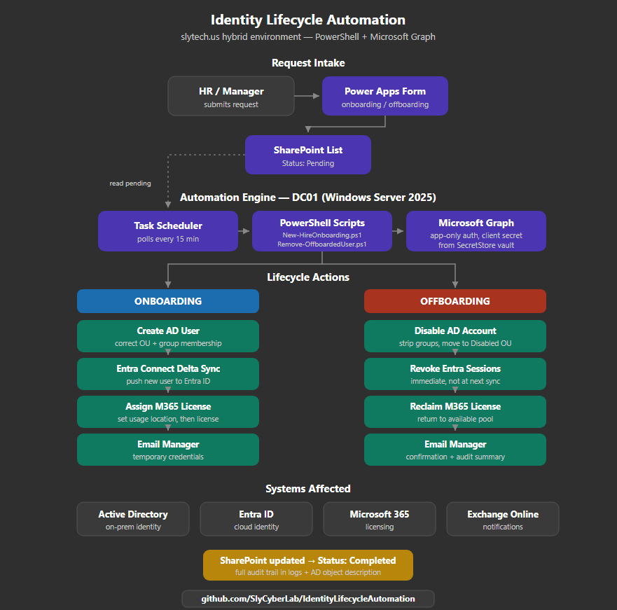

# 🔐 Identity Lifecycle Automation - HR-Driven Onboarding & Offboarding

> **An end-to-end identity lifecycle pipeline that provisions new hires and deprovisions departing employees across Active Directory and Microsoft 365 with zero manual intervention, triggered from a SharePoint form and run unattended on a schedule.**


📖 **Full write-up:** [Automating Identity Lifecycle on the blog](https://blog.slytech.us/blog/identity-automation)

Part of the [SlyTech Hybrid Cloud & Security Lab Series](https://blog.slytech.us).

---

## 📋 Overview

This project automates the full identity lifecycle for the `slytech.us` hybrid environment. A manager submits a request through a Power Apps form, and a scheduled PowerShell job running on DC01 picks it up and executes every step against Active Directory and Microsoft 365 using the Microsoft Graph API. No human touches the provisioning or deprovisioning process.

The goal is to close two gaps that exist in almost every environment: the time sink of repetitive manual onboarding, and the security risk of offboarding that never gets finished, leaving terminated accounts live for days after someone leaves.

**Result:** A brand new Active Directory object to a fully licensed M365 user with the manager notified, in under three minutes of unattended execution. Offboarding disables the account, revokes all active sessions, and reclaims the license in roughly 30 seconds.

### 🎯 Objectives Achieved

- ✅ App-only Microsoft Graph authentication with client-secret credentials
- ✅ Secret stored securely in PowerShell SecretStore, never hardcoded
- ✅ SharePoint list and Power Apps form as the request front door
- ✅ Automated AD user creation with department-driven OU and group placement
- ✅ Entra Connect delta sync triggered programmatically
- ✅ Usage location handling and M365 license assignment via Graph
- ✅ Automated offboarding with session revocation and license reclamation
- ✅ Manager email notifications for both workflows
- ✅ Full audit trail in structured logs, transcripts, and AD object descriptions
- ✅ Unattended scheduled execution via Task Scheduler on Windows Server 2025

---

## 🏗️ Architecture



The full onboarding sequence runs eight distinct actions without manual intervention; offboarding runs nine.

---

## 📂 Repository Structure

```
IdentityLifecycleAutomation/
├── scripts/
│   ├── New-HireOnboarding.ps1       # Onboarding pipeline
│   └── Remove-OffboardedUser.ps1    # Offboarding pipeline
├── tests/
│   ├── New-HireOnboarding.Tests.ps1
│   └── Remove-OffboardedUser.Tests.ps1
├── screenshots/                     # Build and verification screenshots
└── README.md
```

---

## ⚙️ Prerequisites

### On DC01 (Windows Server 2025)

```powershell
# Install required PowerShell modules
Install-Module Microsoft.Graph -Force
Install-Module Microsoft.PowerShell.SecretManagement -Force
Install-Module Microsoft.PowerShell.SecretStore -Force
Install-Module Pester -Force
```

### In Azure / Entra ID

- App registration with the following Graph API **application** permissions (admin consent granted):
  - `User.ReadWrite.All`
  - `Directory.ReadWrite.All`
  - `Sites.ReadWrite.All`
  - `Mail.Send`
  - `Organization.Read.All`
- Entra Connect installed and syncing `slytech.us`
- M365 Business Premium licenses available in the tenant

### SharePoint

Two lists are required under the IT SharePoint site.

**NewHireRequests**

| Column | Type | Required |
|---|---|---|
| FirstName | Single line of text | Yes |
| LastName | Single line of text | Yes |
| Department | Choice (IT, Sales, Security, HR) | Yes |
| JobTitle | Single line of text | Yes |
| ManagerEmail | Single line of text | Yes |
| StartDate | Date | Yes |
| Status | Choice (Pending, Completed, Failed) | Yes |
| ProvisionedUPN | Single line of text | No |
| CompletedDate | Date and Time | No |

**OffboardingRequests**

| Column | Type | Required |
|---|---|---|
| UPN | Single line of text | Yes |
| DisplayName | Single line of text | Yes |
| ManagerEmail | Single line of text | Yes |
| LastWorkingDay | Date | Yes |
| Status | Choice (Pending, Completed, Failed) | Yes |
| CompletedDate | Date and Time | No |

---

## 🚀 Setup

### 1. Store the app registration secret in SecretStore

```powershell
# Run once on DC01
Register-SecretVault -Name LocalStore -ModuleName Microsoft.PowerShell.SecretStore
Set-Secret -Name "GraphClientSecret" -Secret "your-client-secret-here"

# Allow the vault to unlock without an interactive password prompt (required for scheduled runs)
Set-SecretStoreConfiguration -Authentication None -Interaction None -Confirm:$false
```

### 2. Update configuration in both scripts

Open each script and set the configuration block at the top:

```powershell
$TenantId     = "your-tenant-id"
$ClientId     = "your-app-registration-client-id"
$LicenseSkuId = "your-m365-license-sku-id"  # onboarding script only
```

To find your license SKU ID:

```powershell
Connect-MgGraph -Scopes "Organization.Read.All"
Get-MgSubscribedSku | Select-Object SkuPartNumber, SkuId
```

### 3. Create the Task Scheduler jobs on DC01

Run both jobs under a principal with **S4U** logon type so they execute silently in the background. An Interactive logon type will surface a sign-in window on the desktop every run.

**Onboarding:**

```powershell
$action    = New-ScheduledTaskAction -Execute "pwsh.exe" `
    -Argument "-NonInteractive -File C:\Scripts\New-HireOnboarding.ps1"
$trigger   = New-ScheduledTaskTrigger -RepetitionInterval (New-TimeSpan -Minutes 15) -Once -At (Get-Date)
$principal = New-ScheduledTaskPrincipal -UserId "Administrator" -LogonType S4U -RunLevel Highest
Register-ScheduledTask -TaskName "IdentityLifecycle-Onboarding" `
    -Action $action -Trigger $trigger -Principal $principal -Force
```

**Offboarding:**

```powershell
$action    = New-ScheduledTaskAction -Execute "pwsh.exe" `
    -Argument "-NonInteractive -File C:\Scripts\Remove-OffboardedUser.ps1"
$trigger   = New-ScheduledTaskTrigger -RepetitionInterval (New-TimeSpan -Minutes 15) -Once -At (Get-Date)
$principal = New-ScheduledTaskPrincipal -UserId "Administrator" -LogonType S4U -RunLevel Highest
Register-ScheduledTask -TaskName "IdentityLifecycle-Offboarding" `
    -Action $action -Trigger $trigger -Principal $principal -Force
```

---

## 🗂️ Department Mapping

Department selection on the Power Apps form drives OU placement and group assignment automatically.

| Department | OU | Groups |
|---|---|---|
| IT | `OU=IT,OU=Users,OU=SLYTECH` | IT-Users, FileShare-IT-RW |
| Sales | `OU=Sales,OU=Users,OU=SLYTECH` | Sales-Users, FileShare-Sales-RW |
| Security | `OU=IT,OU=Users,OU=SLYTECH` | IT-Users, IT-Admins |
| HR | `OU=Sales,OU=Users,OU=SLYTECH` | Sales-Users, HR |

---

## 🔁 Workflow Actions

### Onboarding

1. Read pending requests from SharePoint via Graph
2. Create AD user in the department OU with group memberships
3. Trigger Entra Connect delta sync
4. Wait for the user to appear in Entra ID
5. Set usage location and wait for it to propagate
6. Assign M365 license
7. Email temporary credentials to the manager
8. Update SharePoint item to Completed

### Offboarding

1. AD account disabled
2. User removed from all security and distribution groups
3. Account moved to `OU=Disabled,OU=Users,OU=SLYTECH`
4. Description updated with offboard date and audit note
5. Entra Connect delta sync triggered
6. All active Entra ID / M365 sessions revoked immediately
7. All M365 licenses removed
8. Confirmation email sent to the manager
9. SharePoint item updated to Completed

---

## 📸 Screenshots

Build and verification screenshots for both pipelines live in the [`screenshots/`](./screenshots) directory, covering the SharePoint and Power Apps setup, the Entra app registration, and full successful runs of both onboarding and offboarding with their email and AD verification.

---

## 📝 Logging

Each run writes to two destinations:

- **Structured log:** `C:\Logs\HireAutomation\onboarding.log` / `offboarding.log`
- **Transcript:** `C:\Logs\HireAutomation\Transcript-YYYYMMDD-HHmmss.log`

Log format:

```
2026-06-18 10:35:50 [INFO] ===== Identity Lifecycle Automation - New Hire Onboarding =====
2026-06-18 10:36:08 [INFO] Found 1 pending request(s)
2026-06-18 10:36:08 [INFO] Creating AD user: tuser@slytech.us in OU: OU=IT,OU=Users,OU=SLYTECH,DC=slytech,DC=us
2026-06-18 10:36:08 [INFO] Added tuser to group: IT-Users
2026-06-18 10:37:08 [SUCCESS] Successfully onboarded: tuser@slytech.us
```

---

## 🧪 Running Tests

```powershell
# Install Pester if not already installed
Install-Module Pester -Force

# Run all tests
Invoke-Pester ./tests/ -Output Detailed

# Run a single suite
Invoke-Pester ./tests/New-HireOnboarding.Tests.ps1 -Output Detailed
Invoke-Pester ./tests/Remove-OffboardedUser.Tests.ps1 -Output Detailed
```

---

## 🔒 Security Notes

- Client secret stored in PowerShell SecretStore, never hardcoded
- App-only Graph authentication via `-ClientSecretCredential`, no interactive sign-in
- Temporary passwords expire on first login (`ChangePasswordAtLogon = $true`)
- Offboarding revokes sessions immediately, not at the next sync cycle
- All actions timestamped and logged for an audit trail
- Credentials are emailed for lab purposes only. In production, use an encrypted messaging platform or privileged access workstation for credential delivery

---

## 💡 Lessons Learned

A condensed version of the gotchas documented in the [full blog write-up](https://blog.slytech.us/blog/identity-automation):

- **WAM hijacks unattended auth.** Even with a client secret, the Graph module falls back to an interactive popup unless the credential is built as a `PSCredential` and passed with `-ClientSecretCredential`.
- **SecretStore prompts for a password by default.** `Set-SecretStoreConfiguration -Authentication None -Interaction None` lets it unlock silently for a scheduled job.
- **The Graph SDK returned empty objects for list items.** Dropping to raw `Invoke-MgGraphRequest` calls returned clean data every time.
- **`.Count` reports property count on a single object.** Wrapping results in `@(...)` forces an array so the count reflects actual records.
- **Usage location must propagate before licensing.** The script polls Entra to confirm it before assigning a license.
- **Scheduled task logon type matters.** S4U runs silently in the background; Interactive surfaces a window every run.

---

## 🔗 Related Posts

- [Hybrid Identity with Entra Connect](https://blog.slytech.us/blog/entra-connect-hybrid-identity)
- [Intune and Defender for Endpoint](https://blog.slytech.us/blog/intune-defender-endpoint-management)
- [IAM Lab](https://blog.slytech.us/blog/iam-lab)
- [PAM Lab](https://blog.slytech.us/blog/pam-lab)

---

*Part of the [SlyCyberLab](https://github.com/SlyCyberLab) homelab series.*
